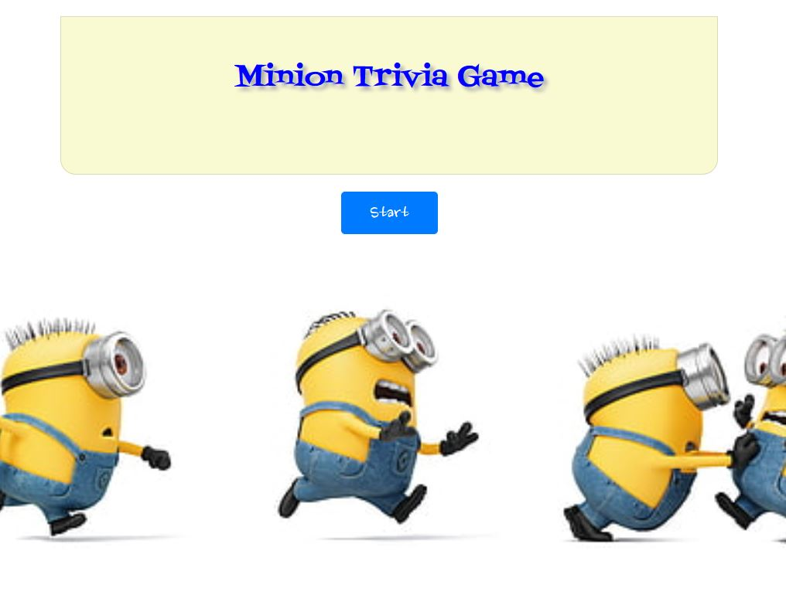

# Minion Trivia Game

## Overview

This is a front end app that uses JavaScript for the logic and jQuery to manipulate HTML. This app has valid HTML and stylish CSS.

## Instructions

- In this game, the user will be given 10 questions about Minions with multiple choice answers.
- There will be 30 seconds timer to answer for each questions.The page will automatically move to next question after 30 seconds.
- The result will be recorded and displayed at the end.
- The user has the option to play the game again by clicking restart.
- There will be giphy images displayed to add a lot of fun and excitement!!! So lets get started and play in the link below:

https://sharmap1.github.io/Trivia-Game/.

## Motivation

I wanted to create a Minion trivia game that was towards the more difficult side and gave animation buffs a challenge. This was a huge learning and experience which I shared with my friends and family as well.

## Screenshot



## Installation

```
Git - Installing Git: Run git from terminal

git clone git://github.com/sharmap1/Trivia-Game.git

```

## Usage

```
Launch project from any code editor i.e. Sublime, Atom, VS Code, etc.

Open app in any supported web browser i.e. Chrome, Firefox, Safari, etc.
```

## Technologies used

- Google Fonts
- Bootstrap
- jQuery

## Contributing

- Pull requests are welcome. For major changes, please open an issue first
  to discuss what you would like to change.

## History

```
This marks the end of unit 5 where we have learned JavaScript & jQuery
fundamentals, as well as touched on timing events, and giphy images.
```

## Credits

```
The Coding Bootcamp @ University of Washington

Instructor: Joel Stedman & TA s : Nick Aaland, Austin Williams, Ben Vaagen
```

## License

[MIT](https://choosealicense.com/licenses/mit/)

## Copyright

Copyright (c) [2019][prasamsha sharma]
